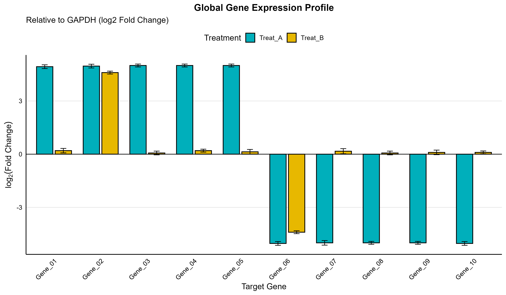
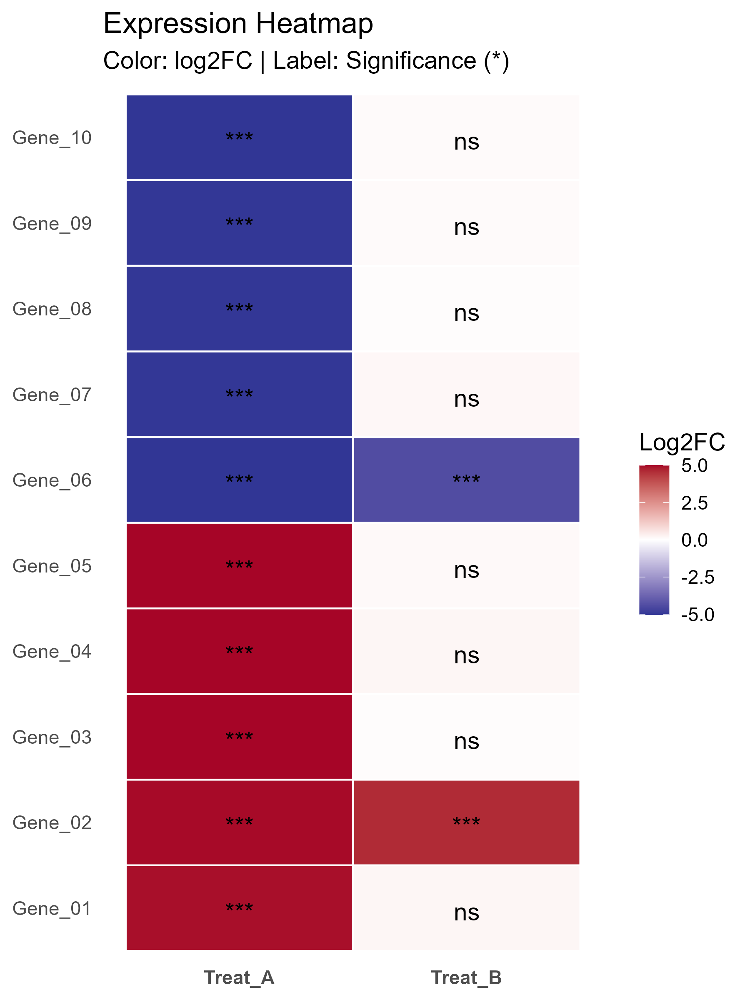

```markdown
# Comprehensive qPCR Analysis Pipeline in R

[](https://doi.org/10.5281/zenodo.XXXXXXX)
*(Note: Replace XXXXXXX with your actual Zenodo DOI number after publishing)*

## Overview
This repository hosts a robust, automated R pipeline designed for the rigorous analysis of Quantitative Real-Time PCR (qPCR) data. Tailored for molecular biology research, this tool streamlines the workflow from raw $C_t$ values to high-resolution, publication-ready figures.

The script relies on the **Livak ($2^{-\Delta\Delta C_t}$)** method for normalization and incorporates **Welch's t-test** (unequal variances) to ensure statistical reliability.

## Key Features
*   **Flexible Data Input:** Accepts raw data in standard CSV format (Demo data included).
*   **Statistical Rigor:**
    *   Calculates Fold Change & log2 Fold Change.
    *   Performs Welch's t-test for statistical significance ($p$-values).
    *   Computes 95% Confidence Intervals (CI) for error estimation.
*   **Publication-Quality Visualization:**
    *   Global Bar Plots: High-contrast profiles with error bars.
    *   Volcano Plots: Dynamic thresholding for Up/Down-regulated genes.
    *   Heatmaps: Expression gradients with significance markers.
    *   Individual Gene Plots: Auto-generated separate plots for detailed inspection.

## Getting Started

### Prerequisites
You need **R** (version 4.0+) and the following packages:
```r
install.packages(c("tidyverse", "ggrepel", "RColorBrewer", "scales", "gridExtra"))
```

### Usage
1.  **Clone the repository:**
    ```bash
    git clone https://github.com/hossein-noorollahi/qPCR_Analysis_Pipeline.git
    ```
2.  **Open the script:** Load `qPCR_Analysis_Pipeline.R` in RStudio.
3.  **Input Data:**
    *   The script includes a standardized **Demo Dataset** embedded in the code.
    *   To use your own data, simply replace the `raw_data` block or import a `.csv` file with columns: `Sample`, `Target`, `Ct`.
4.  **Run:** Execute the entire script.

## Output Examples

The pipeline automatically generates a suite of high-resolution figures. Below are samples created from the included demo data.

### Global Expression Profile


### Expression Heatmap


### Volcano Plot


---

The script also generates a full statistical report in CSV format (`qPCR_Detailed_Analysis.csv`) and a dedicated folder (`Individual_Gene_Plots/`) containing a separate plot for each gene.

## License
This project is licensed under the **MIT License** - see the [LICENSE](LICENSE) file for details.

## Author
**Hossein Noorollahi**  
Ph.D. Candidate in Molecular Genetics
```
