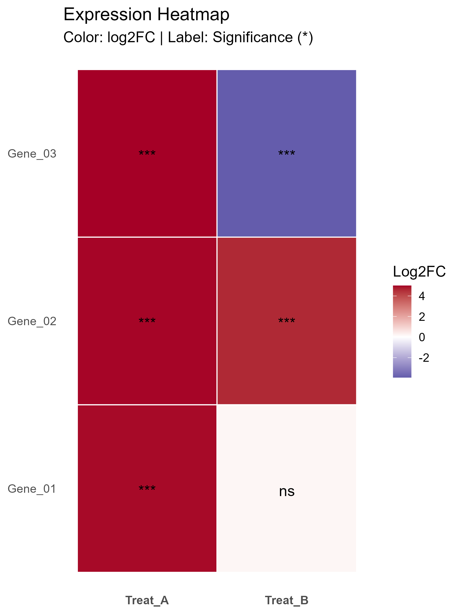
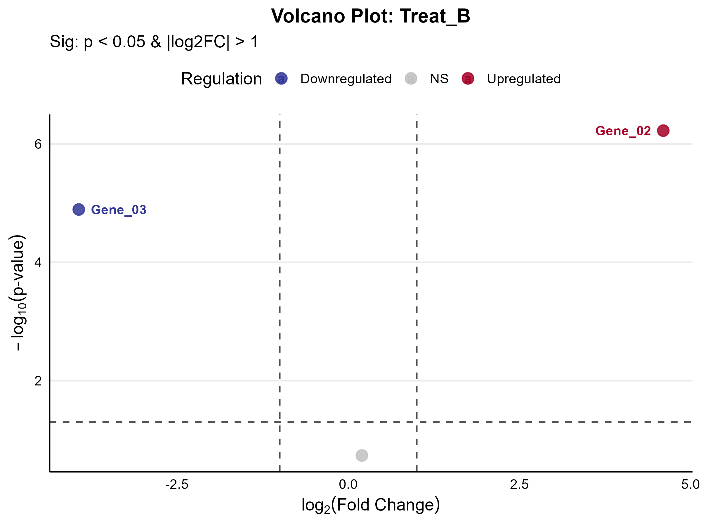

# Advanced qPCR Analysis Pipeline 🧬

An automated, highly reproducible R framework designed to streamline the analysis of Quantitative Real-Time PCR (qPCR) data using the comparative Ct (Livak, 2^-ddCt) method.

**Lead Developer:** Hossein Noorollahi

## ✨ Key Features
- **Automated Data Parsing:** Directly reads raw CSV outputs.
- **Robust Statistics:** Applies Welch's t-test for unequal variances and calculates 95% Confidence Intervals.
- **Publication-Ready Visualizations:** Automatically generates high-resolution Heatmaps, Volcano Plots, and Global Bar Plots.

## 📊 Sample Outputs

### 1. Expression Heatmap
*(A clear overview of up/down-regulated genes across all treatments with statistical significance labels).*

### 2. Volcano Plot
*(Dynamic thresholding for clear visualization of significantly dysregulated targets).*

## 🚀 How to Use
1. Clone this repository or download the script.
2. Place your raw data in a file named `dummy_qPCR_data.csv` (or edit the filename in the script).
3. Format: `Sample, Target, Ct` (3 columns).
4. Run the R script!

## 📜 License
This software is distributed under the [MIT License](LICENSE).
